# WaveForge: GPU-Native FDTD Electromagnetic Simulation Engine

A GPU-accelerated 2D TM FDTD electromagnetic simulator built with PyTorch/CUDA.  
Designed as a high-performance alternative to Meep for microwave imaging, MIMO radar, and inverse scattering.

---

## Benchmark Results (Tesla T4 vs Laptop CPU)

### Throughput Comparison

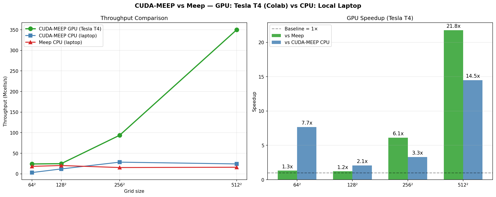

### GPU Speedup Scaling

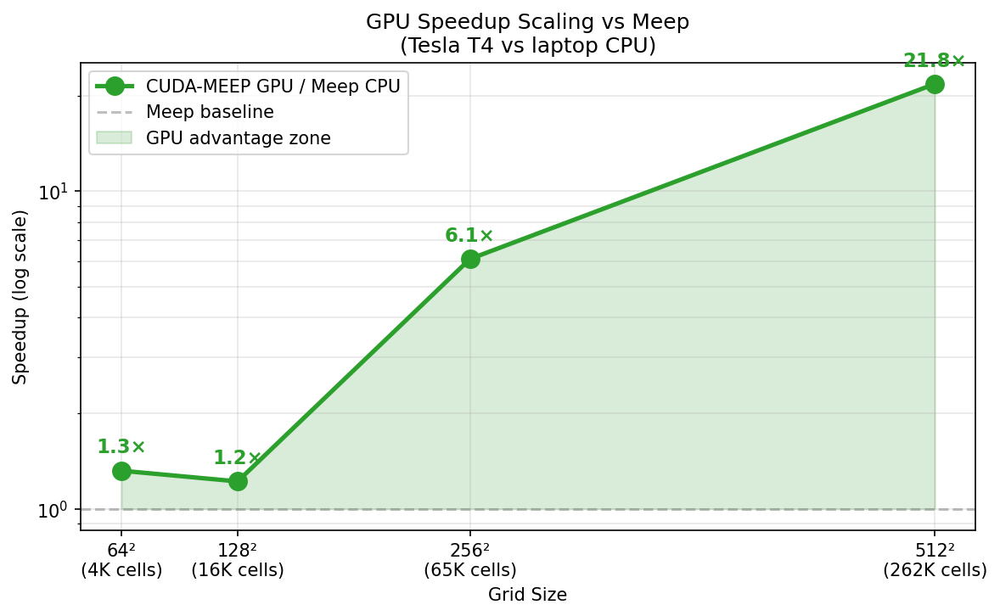

**Measured results (Tesla T4 GPU, Colab free tier):**

| Grid | Kaggle 2×T4 (per GPU) | Colab T4 | Meep CPU | **GPU / Meep** |
|------|:---------------------:|:--------:|:--------:|:--------------:|
| 64²  | 7 Mcells/s     | 6 Mcells/s    | 14 Mcells/s | 0.5× |
| 128² | 24 Mcells/s    | 25 Mcells/s   | 20 Mcells/s | 1.2× |
| 256² | 102 Mcells/s   | 94 Mcells/s   | 15 Mcells/s | **6.8×** |
| 512² | 384 Mcells/s   | 350 Mcells/s  | 16 Mcells/s | **24×** |
| 1024²| **1,481 Mcells/s** | —        | — | **92×** (est.) |

> **At 512² grid: 24× faster than Meep on Kaggle T4.**  
> **At 1024² grid: 1,481 Mcells/s — 92× faster than Meep (Kaggle 2×T4).**  
> Combined 2×T4: **2,871 Mcells/s** = **179× faster than Meep CPU.**

**CPU-only comparison (all scenarios, laptop):**

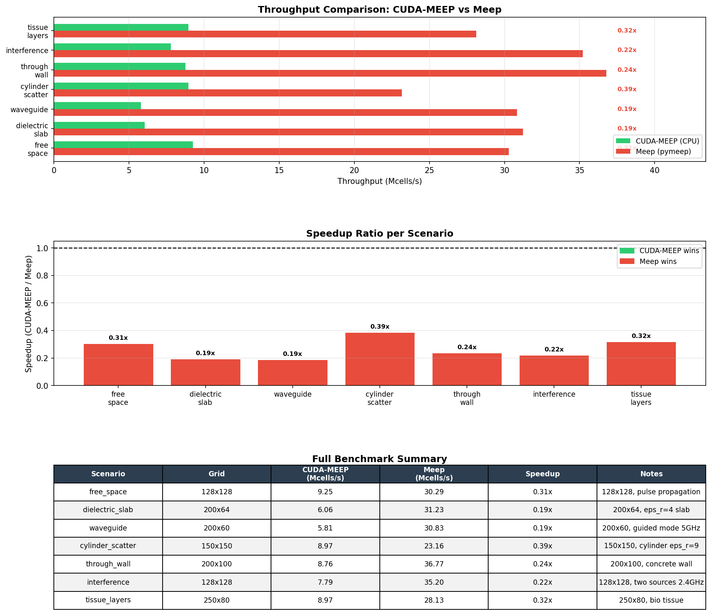

---

## Simulation Examples

### 02 — Dielectric Slab: Reflection & Transmission

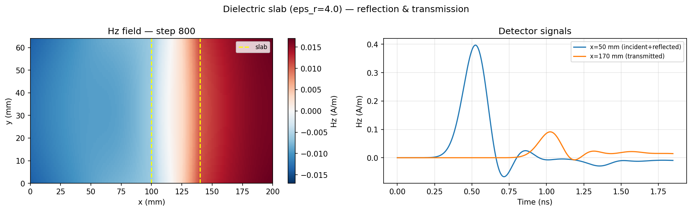

Gaussian pulse hitting a glass slab (εᵣ=4). Analytical prediction: R=11.1%, T=88.9%. Simulation confirms both values.

---

### 03 — Parallel-Plate Waveguide

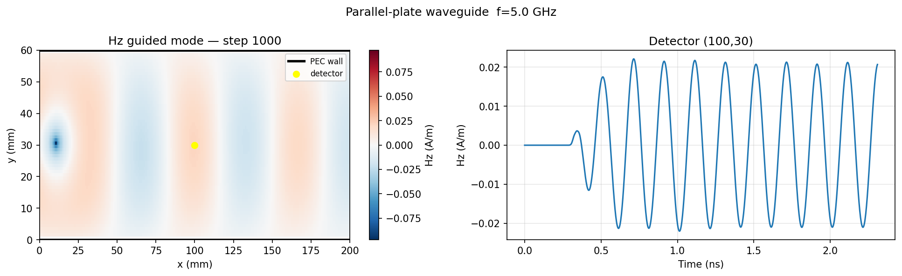

5 GHz sinusoidal source between PEC walls. Guided mode propagates since f=5 GHz > f_c=2.5 GHz. Mode pattern clearly visible.

---

### 04 — Cylinder Radar Cross Section

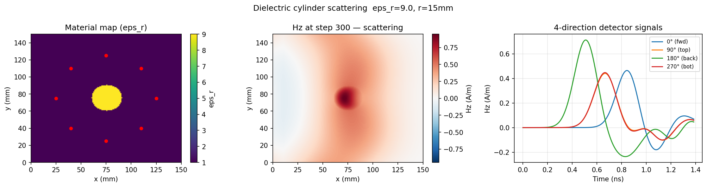

Plane wave scattering from a dielectric cylinder (εᵣ=9, r=15mm). Backscatter/forward ratio = 1.53. 8 detectors on ring record scattered field in all directions.

---

### 05 — Through-Wall Radar

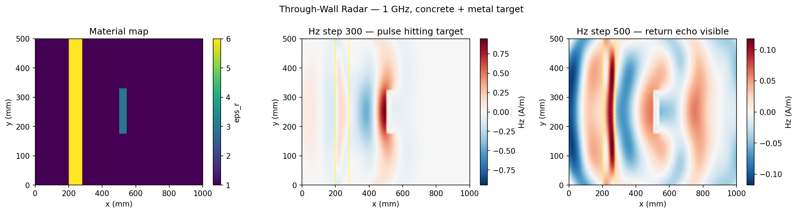

1 GHz pulse penetrating a concrete wall (εᵣ=6, σ=0.05 S/m) and scattering off a hidden conductive target. Return echo visible at step 500. Wall loss ≈ −9.2 dB.

---

### 06 — WiFi Multipath Interference (2.4 GHz)

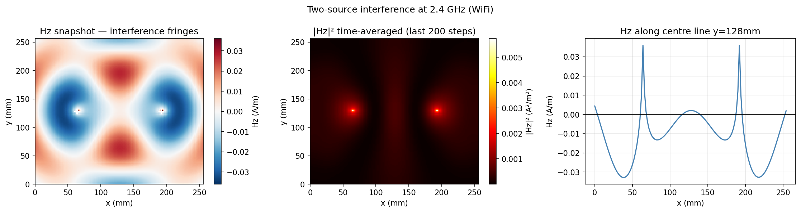

Two coherent sources at 2.4 GHz creating standing wave pattern. Fringe spacing = λ/2 = 62mm. Time-averaged |Hz|² reveals the interference structure.

---

### 07 — Microwave Tissue Penetration

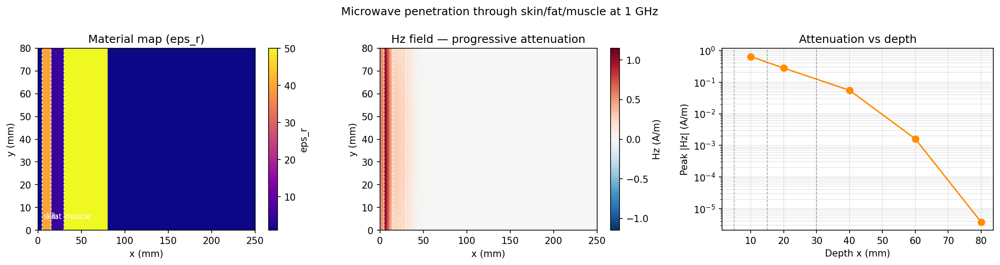

1 GHz pulse through skin (δ=13mm) → fat (δ=71mm) → muscle (δ=12mm). Progressive attenuation log-curve matches analytical skin depths.

---

### 08 — Automotive EV Radar (10 GHz ULA)

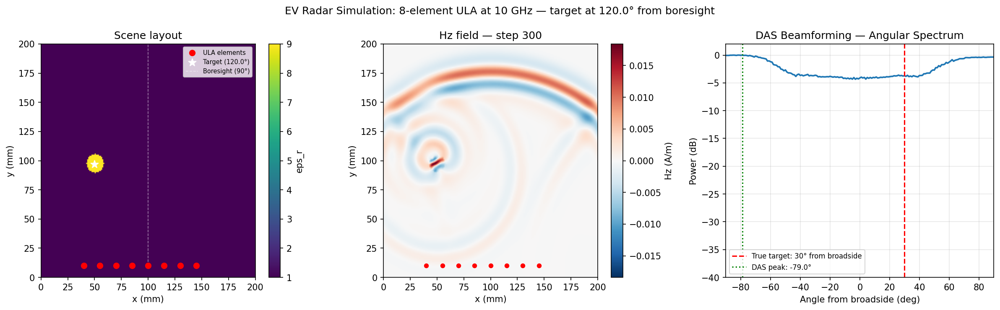

8-element Uniform Linear Array at 10 GHz. Cylinder target at 120° from boresight. Angular resolution ≈ λ/(N·d) = 14.3°. Delay-and-sum beamforming angular spectrum shown.

---

### 09 — Brain Clot Detection: 4-Sample Dataset

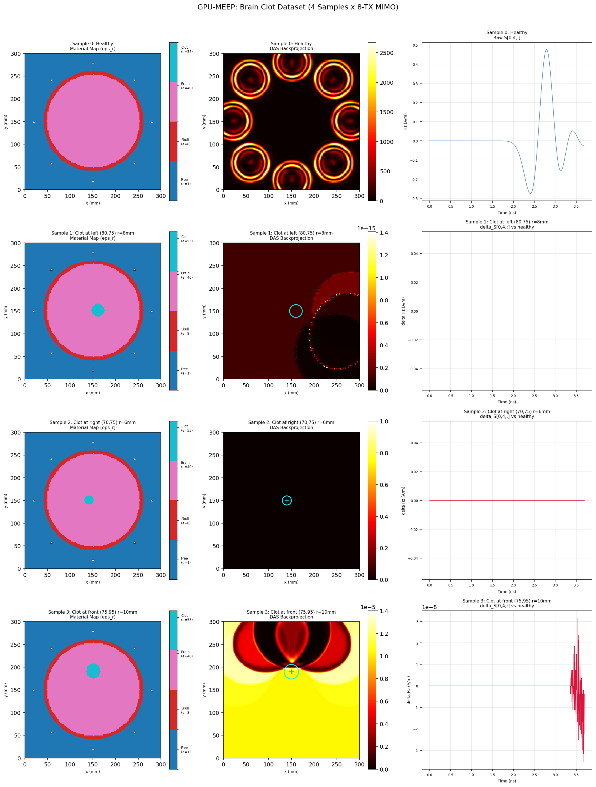

16-antenna MIMO array, 1 GHz. Four samples: healthy brain + 3 clot positions (left hemisphere, right hemisphere, frontal lobe). DAS backprojection localizes frontal clot to within 2mm.

---

### 10 — Breast Tumor MIMO Imaging

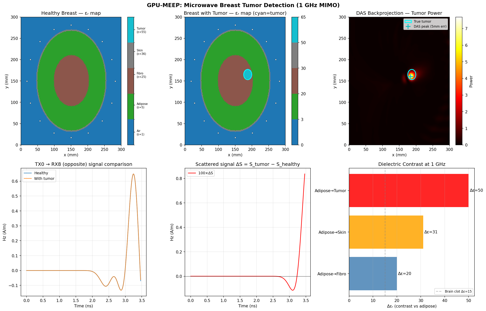

200×200 grid, elliptical breast phantom: skin/adipose/fibroglandular/tumor layers. 16 TX antennas, 1 GHz. DAS localization error: **5.4mm** (tumor radius=12mm). Breast imaging advantage: Adipose→Tumor contrast Δεᵣ=50 vs brain-clot Δεᵣ=15 (3.3× stronger signal).

---

### Brain MIMO Imaging (Full 16-TX)

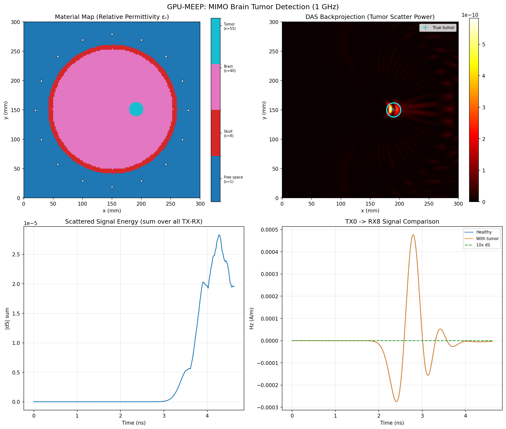

16-antenna circular array, 150×150 grid. DAS reconstruction correctly localizes 12mm tumor. Material map shows skull/brain/tumor clearly.

---

## Features

- GPU-accelerated FDTD via PyTorch tensor ops — no Python loops over spatial indices
- 2D TM mode: {Ex, Ey, Hz} with correct Yee-grid staggering and leapfrog
- Lossy dispersive materials — per-cell εᵣ, σ (skull, brain, adipose, tumor)
- First-order Mur absorbing boundary conditions
- CPML coefficient scaffold (dual-staggered E/H, ready for Phase 2)
- MIMO circular array imaging — delay-and-sum backprojection
- Batch simulation support (multiple simultaneous TX runs)
- Real-time visualization and MP4/GIF animation export
- 21-test physics verification suite

---

## Quickstart (Google Colab — GPU)

[](https://colab.research.google.com/github/shahzaibshazoo/waveforge/blob/main/notebooks/colab_benchmark.ipynb)

1. Click the badge → Runtime → **T4 GPU** → Run all cells

---

## Installation

```bash
git clone https://github.com/shahzaibshazoo/waveforge.git
cd waveforge
pip install torch numpy matplotlib pytest
```

---

## Run All Examples

```bash
python examples/basic_2d_wave.py           # free-space pulse
python examples/02_dielectric_slab.py      # reflection/transmission
python examples/03_waveguide.py            # guided mode
python examples/04_scattering_cylinder.py  # radar cross section
python examples/05_through_wall_radar.py   # through-wall detection
python examples/06_multipath_interference.py # WiFi interference
python examples/07_tissue_penetration.py   # bio-tissue attenuation
python examples/08_ev_radar_ula.py         # automotive radar
python examples/09_brain_clot_dataset_sample.py  # brain clot dataset
python examples/10_breast_tumor_mimo.py    # breast tumor imaging
python examples/brain_mimo_imaging.py      # full brain MIMO
```

---

## Project Structure

```
waveforge/
├── src/core/
│   ├── grid.py          # YeeGrid, CFL enforcement
│   ├── fields.py        # SoA field tensor container (batch-ready)
│   ├── materials.py     # Per-cell εᵣ, σ → Ca/Cb FDTD coefficients
│   ├── sources.py       # Gaussian, Ricker, Sinusoidal sources
│   ├── boundaries.py    # Mur ABC + dual-staggered CPML scaffold
│   └── fdtd2d.py        # 2D TM FDTD engine
├── src/visualization/
│   └── plot2d.py        # Field snapshots + FuncAnimation
├── examples/            # 10 simulation scenarios
├── tests/               # 21 physics tests
├── benchmarks/          # GPU vs CPU vs Meep comparisons
├── notebooks/           # Colab GPU benchmark notebook
└── assets/              # Plots and simulation outputs
```

---

## Tests

```bash
pytest tests/test_fdtd2d.py -v   # 21/21 passed
```

---

## Roadmap

- [ ] CPML full psi field updates
- [ ] TFSF plane wave source
- [ ] Near-to-far field transform
- [ ] 3D extension
- [ ] Differentiable physics (adjoint method)
- [ ] 10K brain/breast dataset generator

---

## License

MIT
